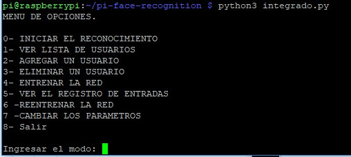
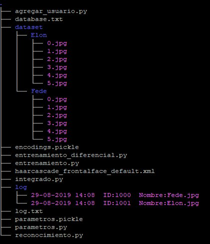

# Facial recognizition using a raspberry pi.
#### ------------------------------------------------------------------------------------
#### Warning: This was my first ever proyect, the coding practices used may not be the best. I was a complete begginer at the time of making this.
#### There's a full report in word report in spanish in the repository.
#### ------------------------------------------------------------------------------------

This proyect uses a raspberry pi 3B and its camera to detect people, to for example, open a door. 
The idea of this proyect is to make a script where you can add new users, tweak the parameters and pick a GPIO pin to activate once a face has been detected. Everything will be saved on a log, and users can also be deleted at any time. There's a terminal interface to make things simpler. 

## Requirements 

* A Raspberry Pi Model 3 or superior. 
* A camera module 

## Installation

Once you are in your raspberry pi terminal, you need to execute the following commands to install all the necessary dependencies. 

* sudo apt-get update && sudo apt-get upgrade 
* sudo apt-get install build-essential cmake unzip pkg-config 
* sudo apt-get install libjpeg-dev libpng-dev libtiff-dev 
* sudo apt-get install libavcodec-dev libavformat-dev libswscale-dev libv4l-dev 
* sudo apt-get install libxvidcore-dev libx264-dev 
* sudo apt-get install libgtk-3-dev 
* sudo apt-get install libcanberra-gtk* 
* sudo apt-get install libatlas-base-dev gfortran 
* wget https://bootstrap.pypa.io/get-pip.py 
* sudo python3 get-pip.py 
* sudo pip3 install numpy 
* sudo apt-get install python3-opencv 
* sudo apt-get install libboost-all-dev 
* sudo pip3 install scipy 
* sudo pip3 install scikit-image 
* sudo pip3 install dlib 
* sudo pip3 install face_recognition 
* sudo pip3 install imutils 
* git clone https://github.com/fedllanes/facial_recognition_pi.git

To start the execution, you position your self into the folder and then execute
* python3 integrado.py 

## Usage

From the menu (in Spanish) you can start the program, see the database of users, add a new user, delete an existing user, train the network with the new faces (first time), see the historical log, re-train the network after adding a new user, and change some parameters. 

Once the program detects a face for 3 frames in a row, it will spit out a visual message saying that the face was recognized, and it can turn on a GPIO pin. It also says how confident the algorithm is.  The first number(1.00) assumes the user is in the database and how confident it is that it’s that user, and the second number how likely it is that it’s this user(assuming it could be someone outside the database) 

## File structure

Besides the different python scripts, there is:
* Dataset folder: in which there are subfolders corresponding to the name of each face and the pictures of that face inside.
* encondings.pickle: Where the parameters(encoding) of each face are saved
* log.txt: Where one can see all the recognized faces 
* log folder: Where one can see the screenshot for each log. 
* parametros.pickle: It saves the default parameters which can be modified throught the menu.

## Libraries used: 

* OpenCV. 
* Dlib 
* Imutils 
* Numpy 

## How does it work? 

The haarcascade_frontalface_default algorithm is used to detect faces and it uses the “Haar characteristics” to do so. Filters are applied throughout the image in order to be able to detect faces(more information can be found at https://opencv-python-tutroals.readthedocs.io/en/latest/py_tutorials/py_objdetect/py_face_detection/py_face_detection.html) 
Once the face is recognized and cropped, face_encodings (based on the dlib library) turns it into a 128 dimensions vector and it is saved to encodings.pickle.
When a new face is detected, its vector is compared to those in the database, by calculating the eucledian distance. If the distance is lower than 0.6, we assume it's the same person.

